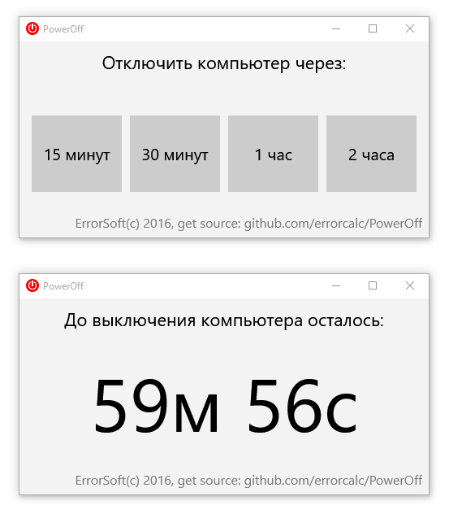

# PowerOff

**ENG**
PowerOff - Very simple application for auto shutdown the computer.

It is useful app, if you before sleep like watch videos on YouTube/music/TV shows/movies, but they continue playing all night, causing a headache in the morning ...

Utility was written, to check the suitability of the FireMonkey technology to develop - in general - yes, at the moment, under Windows (and to simulate the interface UWP), it is a workable technology.

# Download PowerOff app:
https://raw.githubusercontent.com/errorcalc/PowerOff/master/Release/PowerOff.exe

**RUS**
PowerOff - максимально упрощенное приложение для автоотключения компьютера.

Полезно если вы перед сном любите включать ролики на YouTube/музыку/сериалы/фильмы, но засыпаете и они продолжают играть всю ночь, вызывая на утро головную боль...

По большому счету утилита была написана и с целью проверить пригодность технологии FireMonkey для разработки - в целом - да, на данный момент, под Windows (и для имитирования UWP интерфейса), это вполне работоспособная технология.

Хотя и есть нюансы - если вам необходимы FMX компоненты или дизайн интерфейса, учитывающие эти нюансы - вы можете заказать разработку.

# Скачать приложение PowerOff:
https://raw.githubusercontent.com/errorcalc/PowerOff/master/Release/PowerOff.exe
